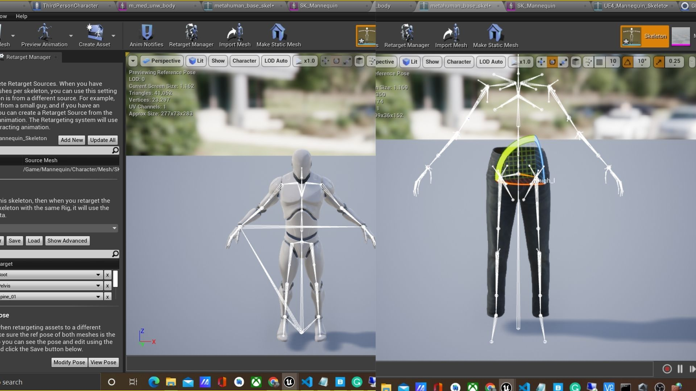
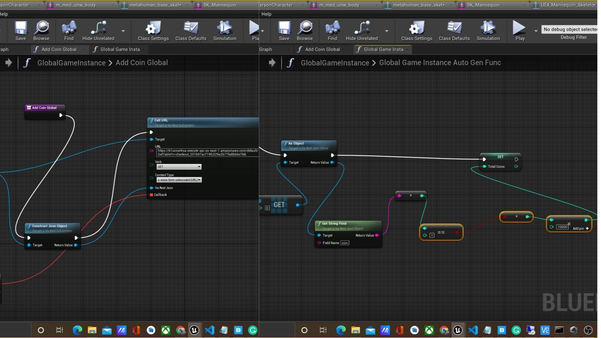
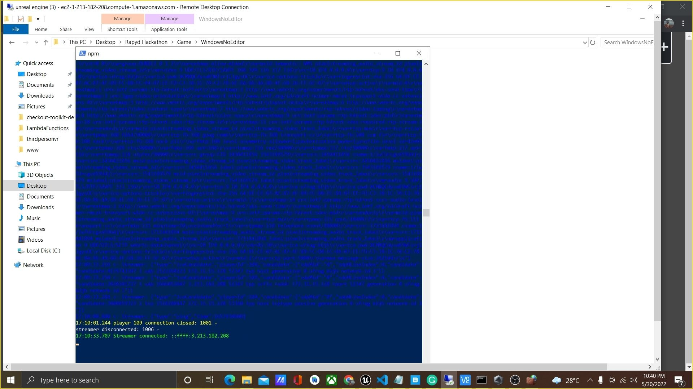
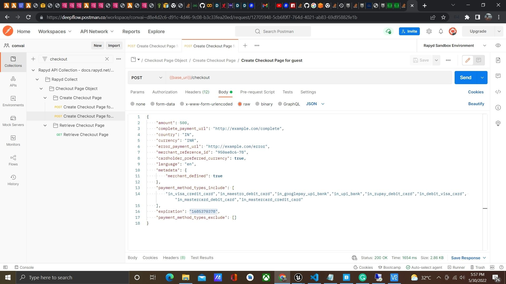
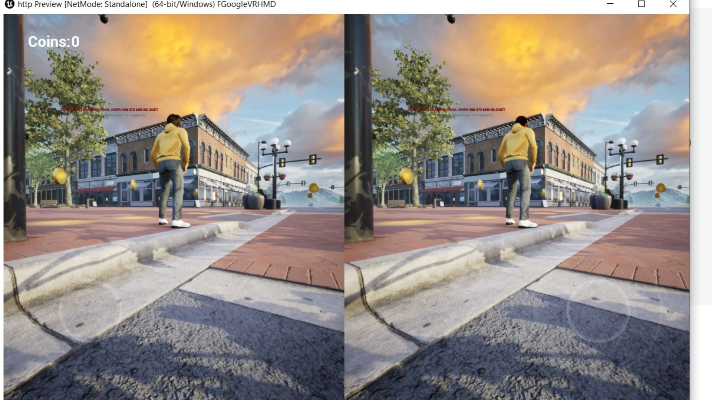

# Rapyd-checkout-page-ue4
Integrating rapyd checkout page with cloud streaming game powered by unreal engine

# Game
1. The game uses third person template from unreal engine
2. We created a modular city package map as the default game map. The map is available free from unreal market place.
3. Created custom 3D metahuman from metahuman editor and is mapped with the throd person template mannequin skeleton.
4. Created thrid person and first person camera swapping feature.
5. Created Gold coins and coin counter feature along with VARest plugin for REST Api integration.

## RESTFul API integration on game

